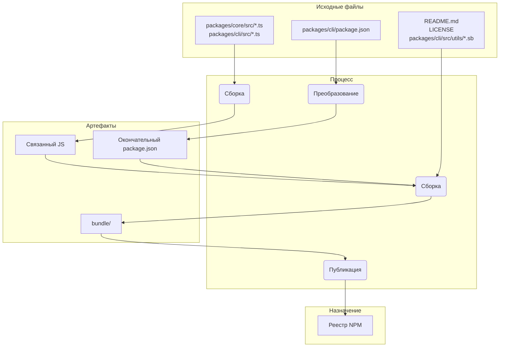

# Обзор пакетов

Этот монорепозиторий содержит два основных пакета: `@google/gemini-cli` и `@google/gemini-cli-core`.

## `@google/gemini-cli`

Это основной пакет для Gemini CLI. Он отвечает за пользовательский интерфейс, разбор команд и все остальные функции, ориентированные на пользователя.

Когда этот пакет публикуется, он объединяется в один исполняемый файл. Этот пакет включает все зависимости пакета, включая `@google/gemini-cli-core`. Это означает, что независимо от того, устанавливает ли пользователь пакет с помощью `npm install -g @google/gemini-cli` или запускает его напрямую с помощью `npx @google/gemini-cli`, он использует этот единый, самодостаточный исполняемый файл.

## `@google/gemini-cli-core`

Этот пакет содержит основную логику для взаимодействия с Gemini API. Он отвечает за выполнение запросов API, обработку аутентификации и управление локальным кэшем.

Этот пакет не объединяется. Когда он публикуется, он публикуется как стандартный пакет Node.js со своими собственными зависимостями. Это позволяет использовать его как автономный пакет в других проектах, если это необходимо. Весь транспилированный код js в папке `dist` включается в пакет.

# Процесс выпуска

Этот проект следует структурированному процессу выпуска, чтобы гарантировать правильное версионирование и публикацию всех пакетов. Процесс разработан таким образом, чтобы быть максимально автоматизированным.

## Как выпускать

Выпуски управляются через рабочий процесс GitHub Actions [release.yml](https://github.com/google-gemini/gemini-cli/actions/workflows/release.yml). Чтобы выполнить ручной выпуск для исправления или срочного исправления:

1.  Перейдите на вкладку **Actions** репозитория.
2.  Выберите рабочий процесс **Release** из списка.
3.  Нажмите кнопку раскрывающегося списка **Run workflow**.
4.  Заполните необходимые поля:
    - **Version**: Точная версия для выпуска (например, `v0.2.1`).
    - **Ref**: Ветка или SHA коммита, из которого будет производиться выпуск (по умолчанию `main`).
    - **Dry Run**: Оставьте `true` для тестирования рабочего процесса без публикации или установите `false` для выполнения реального выпуска.
5.  Нажмите **Run workflow**.

## Ночные выпуски

В дополнение к ручным выпускам, этот проект имеет автоматизированный процесс ночных выпусков для предоставления самой последней "передовой" версии для тестирования и разработки.

### Процесс

Каждую ночь в полночь по UTC рабочий процесс [Release](https://github.com/google-gemini/gemini-cli/actions/workflows/release.yml) запускается автоматически по расписанию. Он выполняет следующие шаги:

1.  Извлекает последний код из ветки `main`.
2.  Устанавливает все зависимости.
3.  Запускает полный набор проверок `preflight` и интеграционных тестов.
4.  Если все тесты пройдены успешно, он вычисляет следующий номер ночной версии (например, `v0.2.1-nightly.20230101`).
5.  Затем он собирает и публикует пакеты в npm с тегом `nightly`.
6.  Наконец, он создает выпуск GitHub для ночной версии.

### Обработка сбоев

Если какой-либо шаг в ночном рабочем процессе завершается сбоем, он автоматически создает новую проблему в репозитории с метками `bug` и `nightly-failure`. Проблема будет содержать ссылку на неудачный запуск рабочего процесса для легкой отладки.

### Как использовать ночную сборку

Чтобы установить последнюю ночную сборку, используйте тег `@nightly`:

```bash
npm install -g @google/gemini-cli@nightly
```

Мы также запускаем сборку Google Cloud под названием [release-docker.yml](../.gcp/release-docker.yaml), которая публикует docker-песочницу в соответствии с вашим выпуском. Это также будет перенесено в GH и объединено с основным файлом выпуска после того, как будут урегулированы разрешения учетной записи службы.

### После выпуска

После успешного завершения рабочего процесса вы можете отслеживать его ход на вкладке [GitHub Actions](https://github.com/google-gemini/gemini-cli/actions/workflows/release.yml). После завершения вы должны:

1.  Перейти на [страницу запросов на вытягивание](https://github.com/google-gemini/gemini-cli/pulls) репозитория.
2.  Создать новый запрос на вытягивание из ветки `release/vX.Y.Z` в `main`.
3.  Просмотреть запрос на вытягивание (он должен содержать только обновления версии в файлах `package.json`) и объединить его. Это поддерживает версию в `main` в актуальном состоянии.

## Проверка выпуска

После выпуска новой версии необходимо провести дымовое тестирование, чтобы убедиться, что пакеты работают должным образом. Это можно сделать, установив пакеты локально и запустив набор тестов, чтобы убедиться, что они функционируют правильно.

- `npx -y @google/gemini-cli@latest --version` для проверки того, что push сработал, как ожидалось, если вы не использовали rc или dev tag
- `npx -y @google/gemini-cli@<release tag> --version` для проверки того, что тег был отправлен правильно
- _Это разрушительно локально_ `npm uninstall @google/gemini-cli && npm uninstall -g @google/gemini-cli && npm cache clean --force && npm install @google/gemini-cli@<version>`
- Рекомендуется провести дымовое тестирование базового прогона нескольких команд llm и инструментов, чтобы убедиться, что пакеты работают должным образом. Мы кодифицируем это в будущем.

## Когда объединять изменение версии, а когда нет?

Вышеуказанный шаблон для создания патчей или срочных исправлений из текущих или более старых коммитов оставляет репозиторий в следующем состоянии:

1.  Тег (`vX.Y.Z-patch.1`): Этот тег правильно указывает на исходный коммит в main,
    который содержит стабильный код, который вы намеревались выпустить. Это крайне важно. Любой, кто проверяет
    этот тег, получает точный код, который был опубликован.
2.  Ветка (`release-vX.Y.Z-patch.1`): Эта ветка содержит один новый коммит поверх
    тегированного коммита. Этот новый коммит содержит только изменение номера версии в package.json
    (и других связанных файлах, таких как package-lock.json).

Это разделение хорошо. Оно сохраняет историю вашей основной ветки чистой от специфичных для выпуска
изменений версии, пока вы не решите их объединить.

Это критическое решение, и оно полностью зависит от характера выпуска.

### Объединение обратно для стабильных патчей и срочных исправлений

Вы почти всегда хотите объединить ветку `release-<tag>` обратно в `main` для любого
стабильного патча или срочного исправления.

- Почему? Основная причина — обновить версию в package.json main. Если вы выпускаете
  v1.2.1 из более старого коммита, но никогда не объединяете изменение версии обратно, ваш package.json основной ветки
  по-прежнему будет содержать "version": "1.2.0". Следующий разработчик, который начнет работу над
  следующим выпуском функций (v1.3.0), будет ветвиться от кодовой базы, которая имеет
  неправильный, более старый номер версии. Это приводит к путанице и требует ручного обновления версии
  позже.
- Процесс: После создания ветки release-v1.2.1 и успешной публикации пакета
  вы должны открыть запрос на вытягивание для объединения release-v1.2.1 в main. Этот PR
  будет содержать только один коммит: "chore: bump version to v1.2.1". Это чистая, простая
  интеграция, которая поддерживает вашу основную ветку в синхронизации с последней выпущенной версией.

### НЕ объединяйте обратно для предварительных выпусков (RC, Beta, Dev)

Вы обычно не объединяете ветки выпуска для предварительных выпусков обратно в `main`.

- Почему? Предварительные версии (например, v1.3.0-rc.1, v1.3.0-rc.2) по определению не
  стабильны и являются временными. Вы не хотите загрязнять историю вашей основной ветки серией
  изменений версии для кандидатов в релизы. package.json в main должен отражать
  последнюю стабильную версию выпуска, а не RC.
- Процесс: Ветка release-v1.3.0-rc.1 создается, происходит npm publish --tag rc,
  а затем... ветка выполнила свою цель. Вы можете просто удалить ее. Код для
  RC уже находится в main (или в ветке функций), поэтому функциональный код не теряется. Ветка
  выпуска была лишь временным средством для номера версии.

## Локальное тестирование и проверка: изменения в процессе упаковки и публикации

Если вам нужно протестировать процесс выпуска без фактической публикации в NPM или создания публичного выпуска GitHub, вы можете запустить рабочий процесс вручную из пользовательского интерфейса GitHub.

1.  Перейдите на вкладку [Actions](https://github.com/google-gemini/gemini-cli/actions/workflows/release.yml) репозитория.
2.  Нажмите на раскрывающийся список "Run workflow".
3.  Оставьте опцию `dry_run` отмеченной (`true`).
4.  Нажмите кнопку "Run workflow".

Это запустит весь процесс выпуска, но пропустит шаги `npm publish` и `gh release create`. Вы можете просмотреть журналы рабочего процесса, чтобы убедиться, что все работает должным образом.

Крайне важно тестировать любые изменения в процессе упаковки и публикации локально, прежде чем фиксировать их. Это гарантирует, что пакеты будут опубликованы правильно и будут работать должным образом при установке пользователем.

Чтобы проверить свои изменения, вы можете выполнить сухой запуск процесса публикации. Это будет имитировать процесс публикации без фактической публикации пакетов в реестр npm.

```bash
npm_package_version=9.9.9 SANDBOX_IMAGE_REGISTRY="registry" SANDBOX_IMAGE_NAME="thename" npm run publish:npm --dry-run
```

Эта команда сделает следующее:

1.  Соберет все пакеты.
2.  Запустит все скрипты prepublish.
3.  Создаст tar-архивы пакетов, которые будут опубликованы в npm.
4.  Выведет сводку пакетов, которые будут опубликованы.

Затем вы можете проверить сгенерированные tar-архивы, чтобы убедиться, что они содержат правильные файлы и что файлы `package.json` были обновлены правильно. Tar-архивы будут созданы в корневом каталоге каждого пакета (например, `packages/cli/google-gemini-cli-0.1.6.tgz`).

Выполнив сухой запуск, вы можете быть уверены, что ваши изменения в процессе упаковки верны и что пакеты будут успешно опубликованы.

## Подробный обзор выпуска

Основная цель процесса выпуска — взять исходный код из каталога packages/, собрать его и собрать
чистый, самодостаточный пакет во временном каталоге `bundle` в корне проекта. Этот каталог `bundle` — это то,
что фактически публикуется в NPM.

Вот ключевые этапы:

Этап 1: Проверки перед выпуском и версионирование

- Что происходит: Перед перемещением любых файлов процесс гарантирует, что проект находится в хорошем состоянии. Это включает запуск тестов,
  линтера и проверку типов (npm run preflight). Номер версии в корневом package.json и packages/cli/package.json
  обновляется до новой версии выпуска.
- Почему: Это гарантирует, что выпускается только высококачественный, работающий код. Версионирование — это первый шаг к обозначению нового
  выпуска.

Этап 2: Сборка исходного кода

- Что происходит: Исходный код TypeScript в packages/core/src и packages/cli/src компилируется в JavaScript.
- Перемещение файлов:
  - packages/core/src/\*_/_.ts -> компилируется в -> packages/core/dist/
  - packages/cli/src/\*_/_.ts -> компилируется в -> packages/cli/dist/
- Почему: Код TypeScript, написанный во время разработки, должен быть преобразован в обычный JavaScript, который может быть запущен
  Node.js. Основной пакет собирается первым, так как пакет cli зависит от него.

Этап 3: Сборка окончательного пакета для публикации

Это самый критический этап, на котором файлы перемещаются и преобразуются в их окончательное состояние для публикации. Временная
папка `bundle` создается в корне проекта для размещения содержимого окончательного пакета.

1.  `package.json` преобразуется:
    - Что происходит: package.json из packages/cli/ читается, изменяется и записывается в корневой каталог `bundle`/.
    - Перемещение файлов: packages/cli/package.json -> (преобразование в памяти) -> `bundle`/package.json
    - Почему: Окончательный package.json должен отличаться от того, который использовался в разработке. Ключевые изменения включают:
      - Удаление devDependencies.
      - Удаление специфичных для рабочей области "dependencies": { "@gemini-cli/core": "workspace:\*" } и обеспечение того, чтобы основной код был
        объединен непосредственно в окончательный файл JavaScript.
      - Обеспечение того, чтобы поля bin, main и files указывали на правильные места в окончательной структуре пакета.

2.  Создается пакет JavaScript:
    - Что происходит: Собранный JavaScript из packages/core/dist и packages/cli/dist объединяется в один,
      исполняемый файл JavaScript.
    - Перемещение файлов: packages/cli/dist/index.js + packages/core/dist/index.js -> (объединяется esbuild) -> `bundle`/gemini.js (или аналогичное
      имя).
    - Почему: Это создает единый, оптимизированный файл, который содержит весь необходимый код приложения. Это упрощает пакет,
      устраняя необходимость в том, чтобы основной пакет был отдельной зависимостью в NPM, так как его код теперь включен напрямую.

3.  Копируются статические и вспомогательные файлы:
    - Что происходит: Важные файлы, которые не являются частью исходного кода, но необходимы для правильной работы пакета
      или для его хорошего описания, копируются в каталог `bundle`.
    - Перемещение файлов:
      - README.md -> `bundle`/README.md
      - LICENSE -> `bundle`/LICENSE
      - packages/cli/src/utils/\*.sb (профили песочницы) -> `bundle`/
    - Почему:
      - README.md и LICENSE — это стандартные файлы, которые должны быть включены в любой пакет NPM.
      - Профили песочницы (.sb файлы) являются критически важными активами времени выполнения, необходимыми для работы функции песочницы CLI.
        Они должны находиться рядом с окончательным исполняемым файлом.

Этап 4: Публикация в NPM

- Что происходит: Команда npm publish запускается из каталога `bundle`.
- Почему: Запуская npm publish из каталога `bundle`, только файлы, которые мы тщательно собрали на этапе 3, загружаются
  в реестр NPM. Это предотвращает случайную публикацию любого исходного кода, тестовых файлов или конфигураций разработки,
  что приводит к чистому и минимальному пакету для пользователей.

Сводка потока файлов



Этот процесс гарантирует, что окончательный опубликованный артефакт является специально созданным, чистым и эффективным представлением
проекта, а не прямой копией рабочей области разработки.

## Рабочие области NPM

Этот проект использует [рабочие области NPM](https://docs.npmjs.com/cli/v10/using-npm/workspaces) для управления пакетами в этом монорепозитории. Это упрощает разработку, позволяя нам управлять зависимостями и запускать скрипты для нескольких пакетов из корня проекта.

### Как это работает

Корневой файл `package.json` определяет рабочие области для этого проекта:

```json
{
  "workspaces": ["packages/*"]
}
```

Это сообщает NPM, что любая папка внутри каталога `packages` является отдельным пакетом, который должен управляться как часть рабочей области.

### Преимущества рабочих областей

- **Упрощенное управление зависимостями**: Запуск `npm install` из корня проекта установит все зависимости для всех пакетов в рабочей области и свяжет их вместе. Это означает, что вам не нужно запускать `npm install` в каталоге каждого пакета.
- **Автоматическое связывание**: Пакеты в рабочей области могут зависеть друг от друга. Когда вы запускаете `npm install`, NPM автоматически создаст символические ссылки между пакетами. Это означает, что когда вы вносите изменения в один пакет, изменения немедленно становятся доступными для других пакетов, которые от него зависят.
- **Упрощенное выполнение скриптов**: Вы можете запускать скрипты в любом пакете из корня проекта, используя флаг `--workspace`. Например, чтобы запустить скрипт `build` в пакете `cli`, вы можете запустить `npm run build --workspace @google/gemini-cli`.
